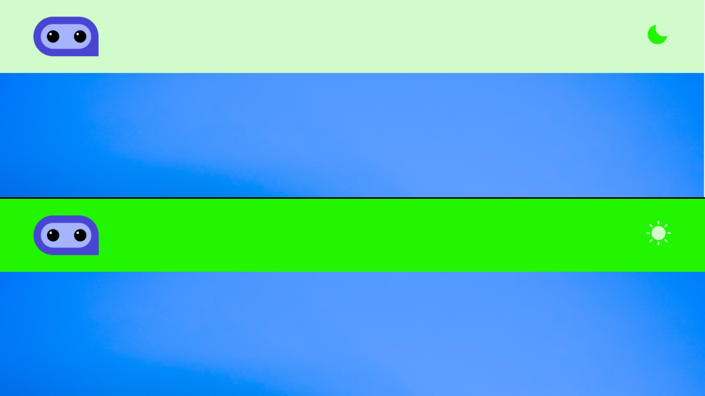

# Landing Page com Temas

Projeto desenvolvido para solidificar meus conhecimentos na Context API utilizando Styled-Components. Criei uma landing page de uma empresa onde é possível alterar o tema de Light para Dark mode e vice-versa, sendo o Light Mode o tema padrão.

## 🔧 Technologies Used

- JSX
- Javascript
- React
- Styled Components
- Context API
- Phosphor React

## 🔗 Visit

To visit the 2023 FIFA Women's World Cup just <a href="#">click here</a>!

## 📱 Demo

| Desktop Version |
|----------------|
|  |
